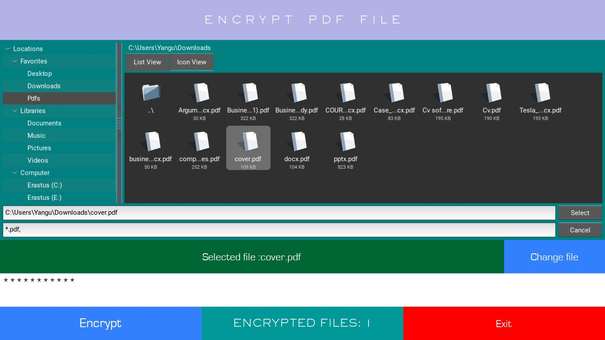

Pdf encryption
==============
This is a GUI pdf encryption programme.

Packages
-----------
```
pip install PyPDF2
pip install kivy-garden
pip install Kivy
```
Requirements
-----------
```
Python 3
```
Usage
-----
```
. Fork the repository to get your own copy.
. Clone it to get a local copy.
. Install the required packages.
. Open the project in your favorite editor.
. Run the main.py file.
. Select the pdf you want to encrpt.
. Click select or double click on your pdf file.
. Enter a password to encrypt with.
. Click encrypt.
. Your file is successfully encrpted and stored in your directory under the folder Encrpted files.

```


Preview
-------



All contributions are welcomed.


